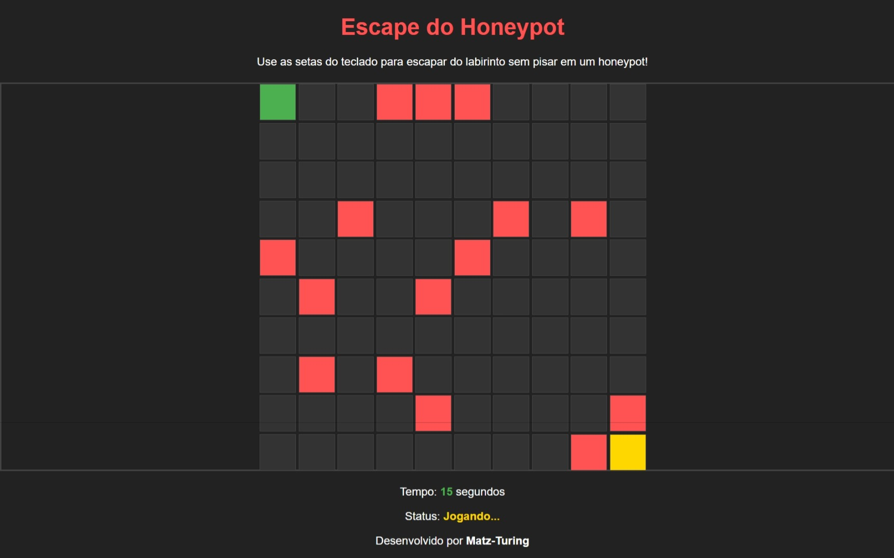

# Escape the Honeypot

**Escape the Honeypot** é um jogo interativo baseado no navegador, projetado para ensinar aos jogadores o conceito de honeypots de maneira divertida e envolvente. Neste jogo, os jogadores navegam por um labirinto baseado em uma grade, tentando alcançar o objetivo sem pisar nos honeypots. Cada honeypot atua como uma armadilha, representando o conceito real de detectar atividades maliciosas.

## Recursos:

- **Jogabilidade Dinâmica**: Honeypots colocados aleatoriamente criam uma experiência única a cada vez.
- **Representação Visual**: Indicadores claros para a posição do jogador, armadilhas (honeypots) e o objetivo.
- **Desafio de Tempo**: Acompanhe a rapidez com que você consegue escapar!
- **Valor Educativo**: Aprenda sobre honeypots e seu papel na cibersegurança enquanto joga.

## Como Jogar:

1. Use as setas do teclado para mover o jogador.
2. Evite as peças vermelhas (honeypots) a todo custo!
3. Chegue à peça amarela (objetivo) para vencer o jogo.
4. Se você pisar em um honeypot, o jogo termina e você precisará tentar novamente.

## Tecnologias Utilizadas:

- **HTML**: Para estruturar a interface do jogo.
- **CSS**: Para estilizar e projetar o tabuleiro do jogo.
- **JavaScript**: Para implementar a lógica do jogo e a interatividade.

## Como Rodar o Jogo:

1. Baixe ou clone o repositório para sua máquina local.
2. Abra o arquivo `index.html` no seu navegador favorito.
3. Jogue o jogo e divirta-se!

**Escape the Honeypot** combina educação e entretenimento, tornando os conceitos de cibersegurança acessíveis e divertidos.

## Créditos

Desenvolvido por Mateus S.  
GitHub: [Matz-Turing](https://github.com/Matz-Turing)
